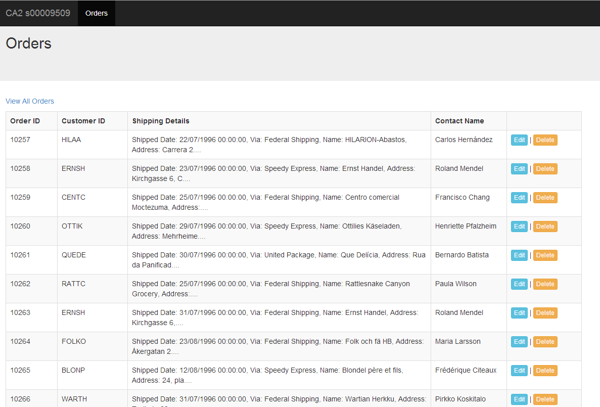
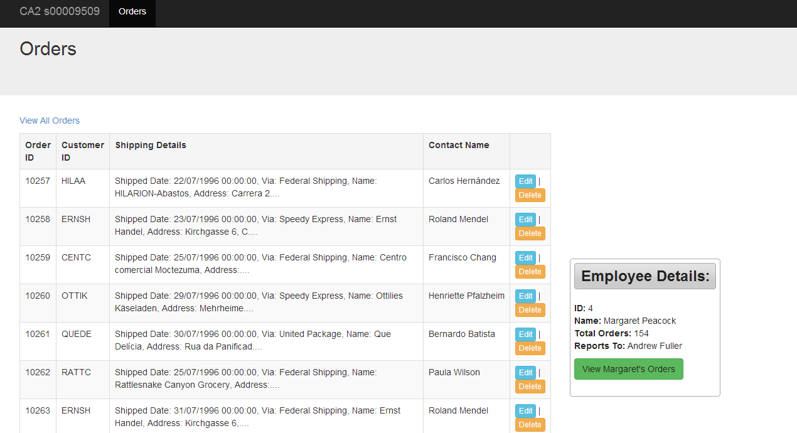
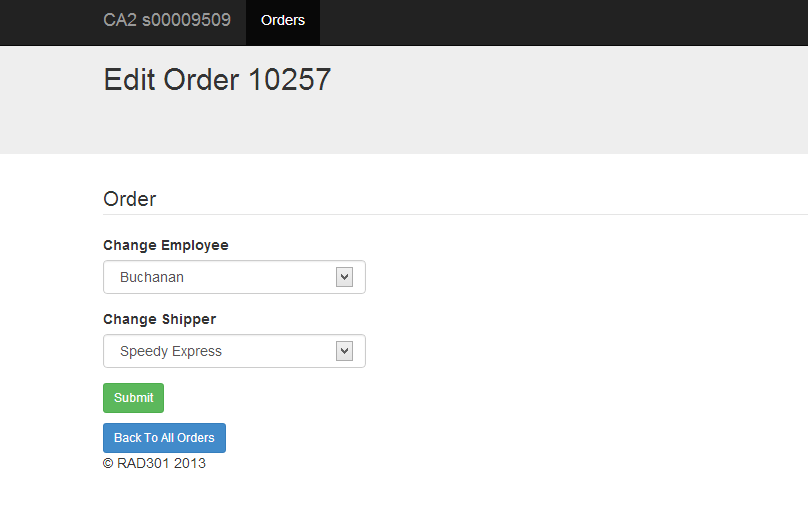
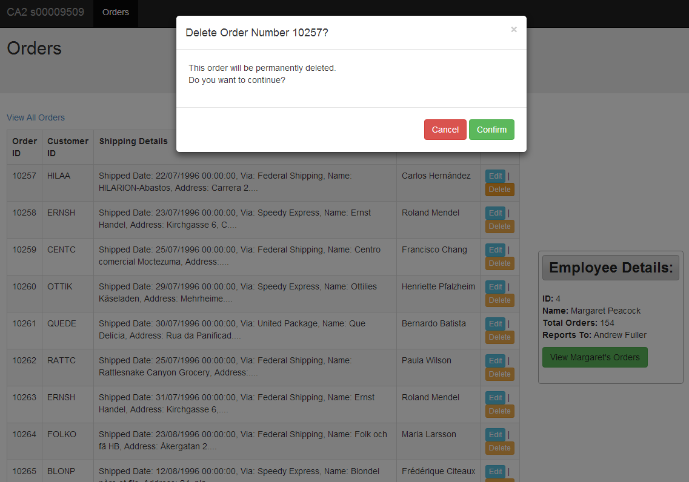
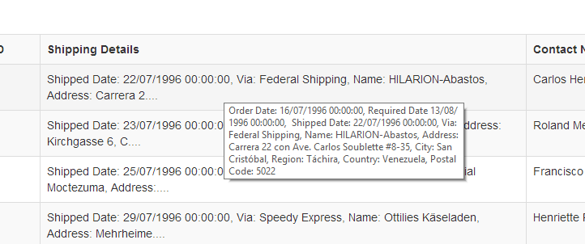

## RAD 301 CA2 MVC Bootstrap App

**Submission Date 09/12/2013**

The application has the following features/functionality:

* Initial (Home) page displays a list of Orders
* Shipping Details are combined into one cell with a limit of 100 characters
* Tooltip provide, so hover on Shipping Details will show full info
* Contact name for the company by whom the Order was placed is in each row
* Clicking on an order will display details of the Employee who is associated with the Order in a jQueryUI box
* This is accomplished using Ajax and Partial View
* Boss is included in Employee details
* Table and box are animated using jQueryUI
* In the Employee details pane, a button is provided to redisplay the same page but listing only those Orders associated with that displayed Employee.
* A link is provided for each Order to edit the Employee and Shipper details of that Order. Dropdown listboxes are provided for Shipper and for Employee so that these associations can be changed for an Order.
* A link is provided for each Order to delete it. A Booststrap Modal box is applied to handle this.
* PagedList is also implemented

---

### Home Page



---

### Employee Details Page



---

### Edit Page



---

### Delete Confirmation



---

### Tooltip



---


### Home Index Method

```csharp
public ActionResult Index(int? empId, int? page)
        {
            if (Request.IsAjaxRequest())
            {
                var e = (db.Employees.Where(em => em.EmployeeID == empId)).FirstOrDefault();

                //to display emp details in box
                return PartialView("_EmpDetails", e);
            }

            // setup PagedList settings
            int pageSize = 10;
            int pageNumber = page ?? 1;
                        
            return View(db.Orders.OrderBy(o=>o.OrderID).ToPagedList(pageNumber,pageSize));
        }


        public ActionResult EmpIndex(int? employeeId, int? page)
        {
            // setup PagedList settings
            int pageSize = 10;
            int pageNumber = page ?? 1;

            var e1 = db.Orders.Where(e => e.EmployeeID == employeeId).OrderBy(o => o.OrderID);

            ViewBag.empID = employeeId;

            if (e1 != null)
            {
                var q = db.Employees.Find(employeeId);
                ViewBag.Title = "Orders By " + q.FirstName + " " + q.LastName;
                
                //to display orders for the particular employee
                return PartialView("_EmpOrders", e1.ToPagedList(pageNumber, pageSize));
               
            }

            return View("Index", db.Orders.OrderBy(o => o.OrderID).ToPagedList(pageNumber, pageSize));
        }          
```


