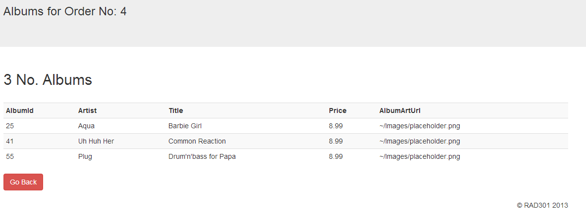

## RAD 301 CA1 MVC Bootstrap App

**Submission Date 12/11/2013**

The application has the following features/functionality:

* Bootstrap 3.0 CSS framework to style web page elements as permitted by the styles
* Entity Framework Data Access Layer
* Initial (Home) page displays a list of Orders for Albums
* Permits searching for an order by First Name
* Sorting of Order List by Date(Ascending and Descending)
* Sorting of Order List by Total value of order(Ascending and Descending)
* Clicking via a button, to show the list of Albums in that Order
* A Back button to revert back to previous page/view
* Implemented a small Partial View for DateTime String in a Template

---

### Home Page


---

### Albums Page



---


### Home Index Method

```csharp
public ActionResult Index(string searchTerm, string sortOrder)
        {
            ViewBag.message = "RAD 301 Music Store Orders";
            ViewBag.TotalSortParam = sortOrder == "Total" ? "Total_desc" : "Total";
            ViewBag.DateSortParam = sortOrder == "Date" ? "Date_desc" : "Date";

            var allOrders = db.Orders.Where(o => searchTerm == null || o.FirstName.Contains(searchTerm));
            
            switch (sortOrder)
            {
                case "Date_desc": allOrders = allOrders.OrderByDescending(o => o.OrderDate);
                    break;

                case "Date": allOrders = allOrders.OrderBy(o => o.OrderDate);
                    break;

                case "Total_desc": allOrders = allOrders.OrderByDescending(o => o.Total);
                    break;

                case "Total": allOrders = allOrders.OrderBy(o => o.Total);
                    break;
            }

            return View(allOrders);
        }
```

---

### Format Order Date With Partial View 

```csharp
@model System.DateTime

@Model.ToShortDateString()
```
Using the above partial view:

```csharp
@Html.DisplayFor(modelItem => item.OrderDate, "ShortDateTime")
```

### Back Button Code

```csharp
@if (Request.UrlReferrer != null)
        {
            <input type="button" class="btn btn-danger" value="Go Back" onclick="history.go(-1); return false;" />
        }
```
