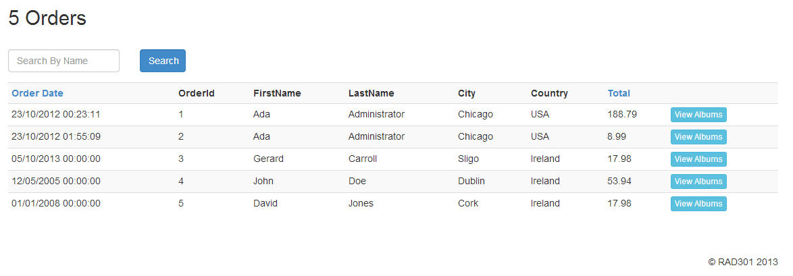

### RAD 301 CA1 MVC Bootstrap App

**Submission Date 12/11/2013**

The application has the following features/functionality:

* Bootstrap 3.0 CSS framework to style web page elements as permitted by the styles
* Entity Framework Data Access Layer
* Initial (Home) page displays a list of Orders for Albums
* Permits searching for an order by First Name
* Sorting of Order List by Date(Ascending and Descending)
* Sorting of Order List by Total value of order(Ascending and Descending)
* Clicking on an Order or via a button, to show the list of Albums in that Order
* A Back button to revert back to previous page/view
